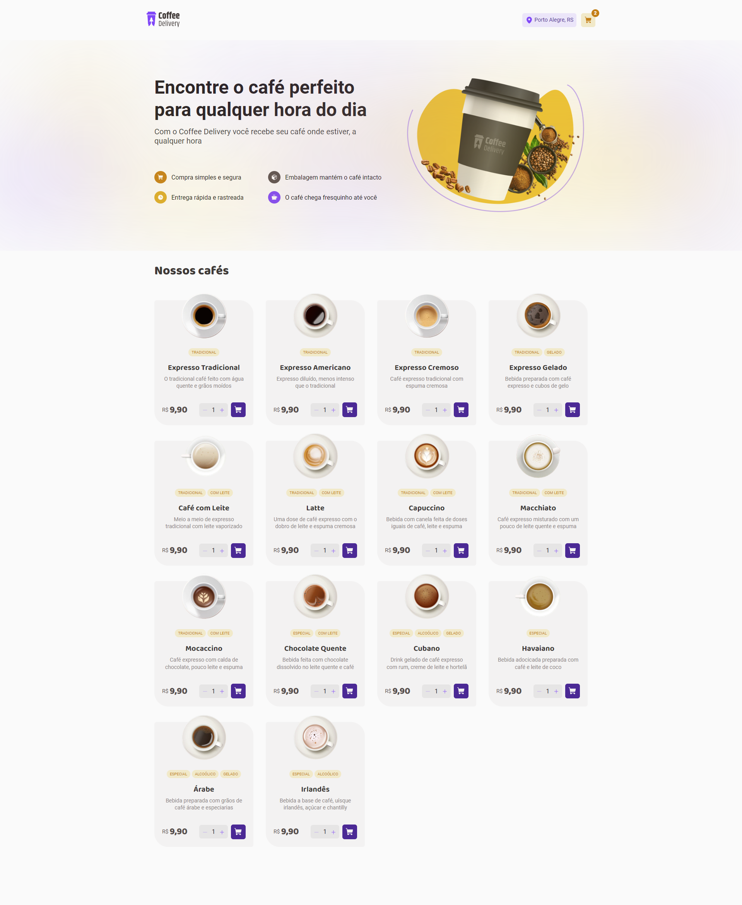
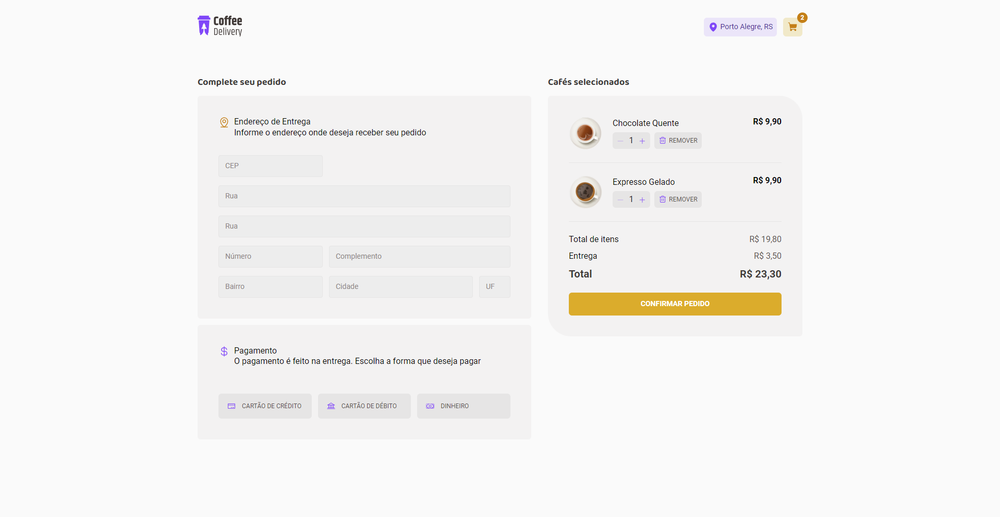

### Description

A coffee delivery app that connects coffee lovers to the best local cafes. 
Enjoy the convenience of having your favorite coffee delivered to your door by 
exploring a variety of quality options. 🚀☕

 
### Screenshots of the Project 📸

<h3 align='left'>Home Page</h3>

  

<h3 align='left'>Checkout Page </h3>

  

### Contribution

Each contribution is a unique piece of development 🧩. Any contribution What you do will be magnificent.

1. Fork the project.
2. Create a Branch for your Feature (git checkout -b feature/FeatureNew)
3. Add your changes (git add .)
4. Commit your changes (git commit -m 'Adding a Visual Notifications Feature')
5. Push from Branch (git push origin feature/FeatureNew)
6. Open a Pull Request